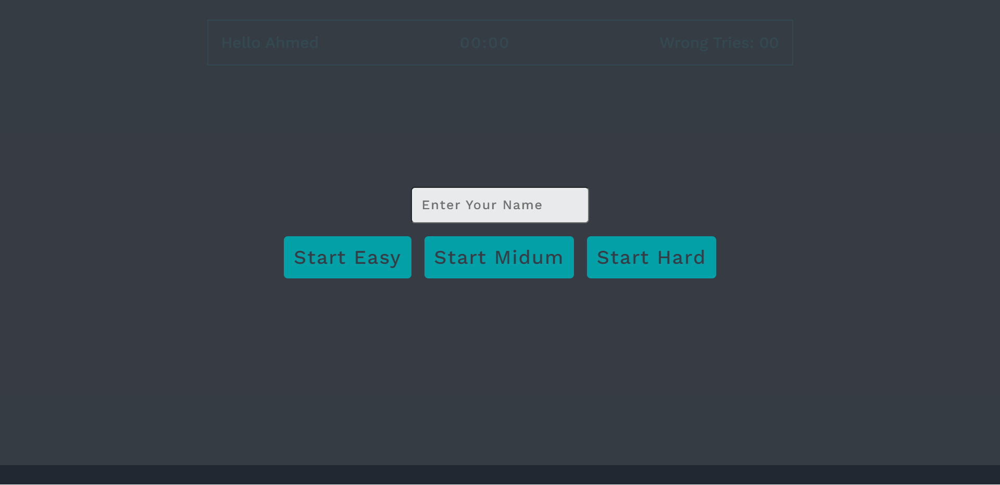
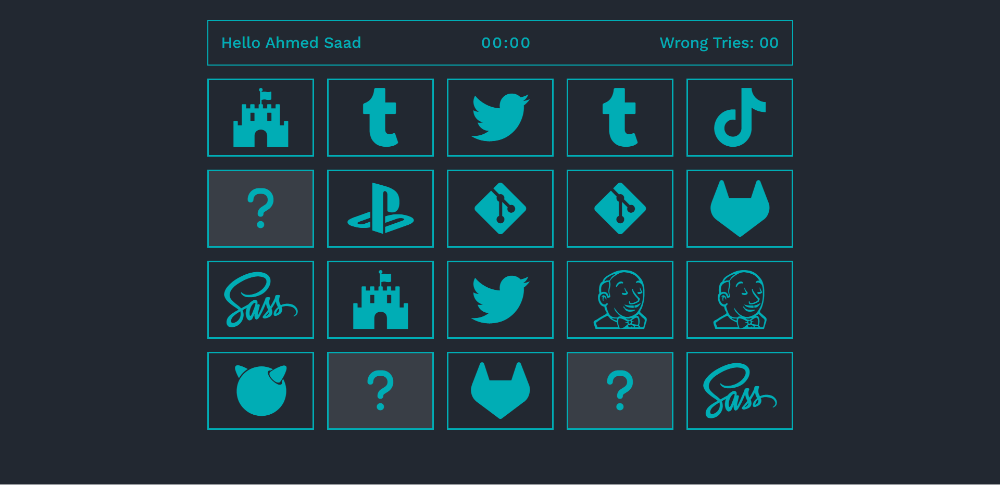
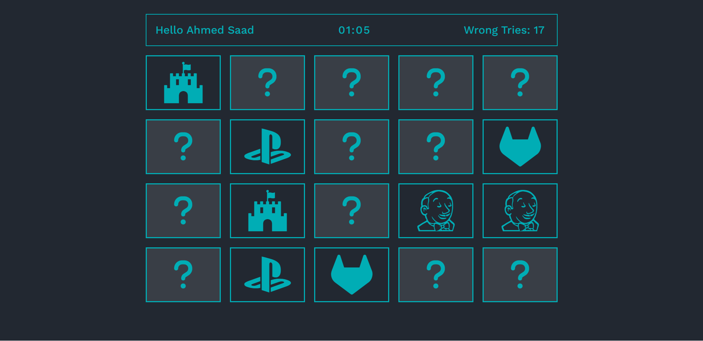
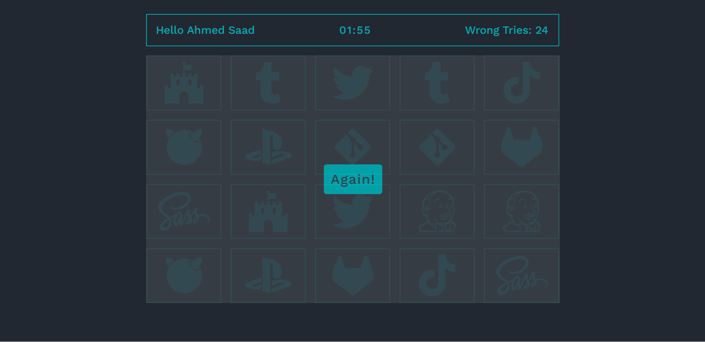

# Flip-Card-Game
This is a Flip Card Game used to check user memory to find identical cards in three levels.
# Covered Topics :
- html5
- css3
- javaScript
- Es6
- Dom - Bom - Json - API
# Site ScreenShot :

